`create-next-app`で作成

## 環境構築

### 1. ローカル環境

- node のバージョンマネージャーに`volta`を使っています。以下のコマンドを実行してインストールしてください。

  `curl https://get.volta.sh/ | bash`

- 再起動して`volta --version`を実行してインストールできたか確認してください。`1.1.1`のようにバージョンが表示されれば大丈夫です。

- 以下のコマンドを実行して`node`をインストールしてください。

  `volta install node@18`

- `node`のバージョンは`v.18.16.0`を使用します。`node --version`を実行して問題ないか確認してください。

### 2. リポジトリの clone

- 以下のコマンドを実行して、ローカルにリポジトリをクローンします。

  `git clone https://github.com/powaaaaa/tsumaguro-frontend.git`

### 3. ライブラリのインストール

- 以下のコマンドを実行して、ライブラリをインストールします。

  `npm i`

## 開発について

- ### 開発サーバーの起動

  1. 以下のコマンドを実行します。

     `npm run dev`

  2. ブラウザで[http://localhost:3000](http://localhost:3000)を開いて結果を確認します。

- ### コミット

  - 以下のコマンドで、現在のパス以下の全てのファイルの変更を記録するようにします。

    `git add .`

  - 以下のコマンドでコミットできます。

    `git commit -m "ここにコミットメッセージ"`

  - コミットは**出来るだけ細かく行ってください**。

- ### ブランチ操作

  - ブランチ

  1. 以下のコマンドを実行してローカルを最新にします。

     `git pull`

  2. `git branch`で現在のブランチが確認できます。

  3. 以下のコマンドを実行してブランチを切り、そのブランチに切り替えます。

     `git switch -c [ブランチ名]`

  4. `git branch`で新しいブランチに移動したことを確認できれば大丈夫です。

  ※**main ブランチ以外**で`push`、`pull`するときは、以下のようにコマンドを実行して下さい。

        git push origin [ブランチ名]
        git pull origin [ブランチ名]

  - マージ

  1. 切ったブランチで作業後、`commit`、`push`まで行います。

  2. GitHub 上のリポジトリに`Pull Request`のボタンが出るので、これを押して`Pull Request`を作成します。

  3. マージしたいブランチを選択して、`Create pull request`を押します。

  4. `Pull Request`の内容を入力する画面になるので、タイトル、詳細を記入します。(適当でいいよ)

  5. 入力後、画面下の`Create pull request`を押すとプルリク完了です。ぽわが approve します。

  6. `Marge pull request`を押し、`Confirm marge`を押すとマージ顔料です。

  7. 最後にローカルに main ブランチを反映させます。`git switch main`で main ブランチへ移動し、`git pull`を実行してください。

## インサイダーゲームについて

(backend から引用)

## ルール

1. プレイヤーは「市民」と「インサイダー」に分けられる(インサイダーのみ答えを知っている)
2. 各プレイヤーはターン毎に ChatGPT に質問をする
3. 質問を終えるとみんなで話し合い答えを決定する
4. もし答えが合わなかったら全員負けになる
5. 答えが合ったらインサイダーを投票する
6. インサイダーを当てた場合「市民」に 1 点，インサイダーを外した場合「インサイダー」に 2 点が入る
7. 全ラウンド終了後に一番点数が高いプレイヤーが勝利

# アプリ概要

```mermaid
sequenceDiagram
    autonumber
    actor user1 as ユーザ(参加者)
    actor user as ユーザ(親)
    participant front as Webページ
    participant api as APIサーバ
    participant db as DBサーバ
    participant ai as Chat GPT
    user->>front: Topページアクセス
    front->>user: home画面を表示
    user->>front: ルーム作成1ページにRequest
    Note over user1,front: ルーム作成
    front->>user: ルーム作成1を表示
    user->>front: ユーザ名を選択
    front->>api: 選択を送信
    api->>db: ユーザ情報を確認
    db->>api: 返却
    api->>db: ユーザ情報を登録
    db->>api: 返却
    api->>front: 返却
    front->>user: ルーム作成2を表示
    user->>front: ルーム設定を選択
    front->>api: 選択を送信
    api->>db: ルーム情報を登録
    db->>api: 返却
    api->>front: 返却
    front->>user: 待機画面を表示
    user1->>front: 待機画面にRequest
    front->>user1: ユーザ登録を表示
    user1->>front: ユーザ登録
    front->>api: 選択を送信
    api->>db: ルーム情報を確認
    db->>api: 返却
    api->>db: ユーザ情報を登録
    db->>api: 返却
    api->>db: ユーザ情報を登録
    db->>api: 返却
    api->>front:　返却
    front->>user1: 待機画面を表示
    loop ラウンド数
        Note over user1,front: ゲーム開始
        user->>front: ゲーム開始
        front->>api: 選択を送信
        api->>db: お題を確認
        db->>api: 返却
        api->>db: ルーム情報を更新
        db->>api: 返却
        api->>front: 返却
        front->>user: 役職を表示
        user->>front: 質問開始
        front->>api: 選択を送信
        api->>db: ルーム情報を更新
        db->>api: 返却
        api->>db: ルーム情報を確認
        db->>api: 返却
        api->>front: 返却
        front->>user: 質問入力欄を表示
        Note over user1,front: 質問開始
        loop 指定回数
            user->>front:　質問を送信
            front->>api: 質問を送信
            api->>ai: 質問を送信
            ai->>api: 返却
            api->>db: ルーム情報を更新
            db->>api: 返却
            api->>db: ルーム情報を確認
            db->>api: 返却
            api->>front: 返却
            front->>user: 返却
        end
        Note over user1,front: 答え合わせ
        user->>front: 答えを選択
        front->>api: 選択を送信
        api->>db: ルーム情報を確認
        db->>api: 返却
        api->>ai: お題と答えの確認
        ai->>api: 返却
        api->>db: ルーム情報を更新
        db->>api: 返却
        api->>db: ルーム情報を確認
        db->>api: 返却
        api->>front: 返却
        front->>user: 結果を表示
        opt 答え==お題の時
            Note over user,front: インサイダーを投票
            user->>front: インサイダーを投票
            front->>api: 選択を送信
            api->>db: ルーム情報を更新
            db->>api: 返却
            api->>db: ルーム情報を確認
            db->>api: 返却
            api->>front: 返却
            front->>user: インサイダーを表示
        end
        user->>front: ラウンド結果を確認
        front->>api: 選択を送信
        api->>db: ルーム情報を確認&更新
        db->>api: 返却
        api->>db: ユーザ情報の更新
        db->>api: 返却
        api->>db: ユーザ情報の確認
        db->>api: 返却
        api->>front: 返却
        front->>user: ラウンド結果を表示
    end
    Note over user,front: 最終結果の発表
    user->>front: 最終結果を表示
    front->>api: 問い合わせ
    api->>db: ユーザ情報を確認
    db->>api: 返却
    api->>front: 返却
    front->>user: 最終結果を表示
        
    Note over user1,front: ゲーム終了
```

# 画面遷移  
* home(/)  
ルール説明とルーム作成  

* ルーム作成(/setting)  
ユーザ名，部屋名，プレイヤー人数，質問回数，ラウンド数を設定

* ルーム入室(/{room_id})  
ユーザ名を登録  

* 参加者待機(/waiting/{room_id}?id={user_id})  
現在の参加者を表示  

* 役職配布(/position/{room_id}?id={user_id})  
インサイダーにお題を公開  

* 質問(/questioning/{room_id}?id={user_id})  
テキストボックスに質問を入力(みんなの質問が揃うまで進行無し)  

* 答え合わせ(/answering/{room_id}?id={user_id})  
お題と答えが一致するか表示  

* インサイダー投票(/voting/{room_id}?id={user_id})  
誰がインサイダーか投票(お題を間違えた場合表示されない)  

* インサイダー投票結果(/voting_result/{room_id}?id={user_id})  
誰がインサイダーか表示(お題を間違えた場合表示されない)  

* ラウンド結果(/round_result/{room_id}?id={user_id})  
ラウンドの結果を表示  

* 最終結果(/final_result/{room_id}?id={user_id})   
全ての得点を表示

役職配布からラウンド結果までは一つにまとめても良い  

# ゲームステータス

0: プレイヤー待機  
1: 役職配布  
2: 質問  
3: お題確認  
4: インサイダー投票  
5: インサイダー結果  
6: ラウンド結果  
7: 次のラウンドへ  
8: 最終結果
